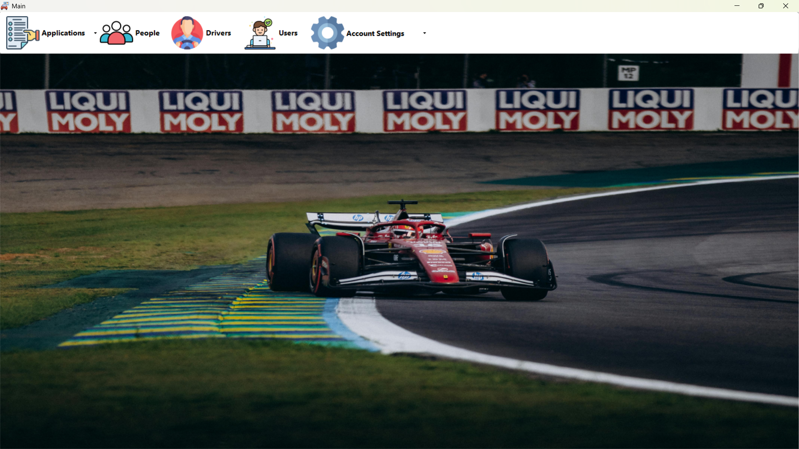
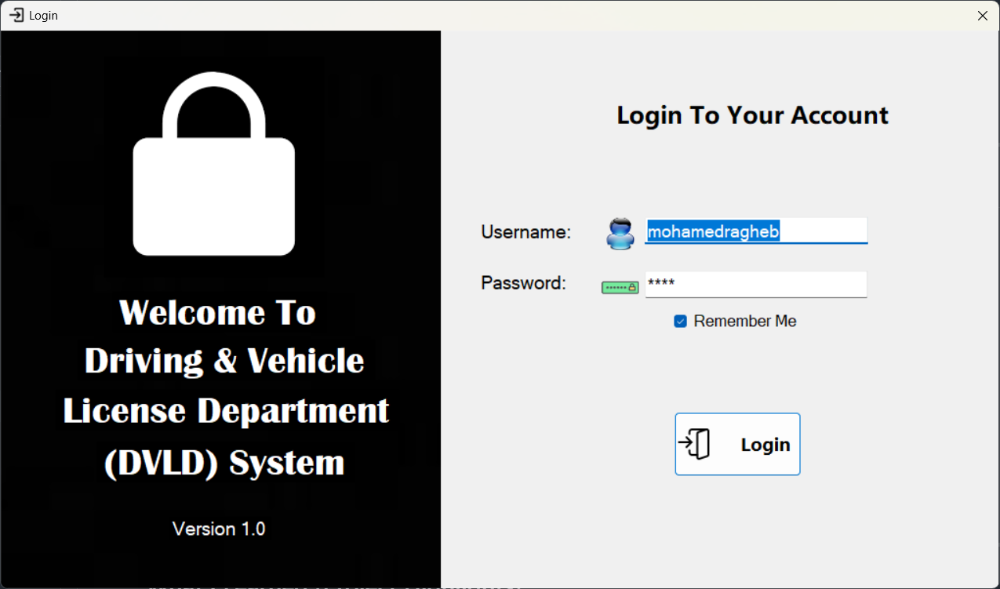
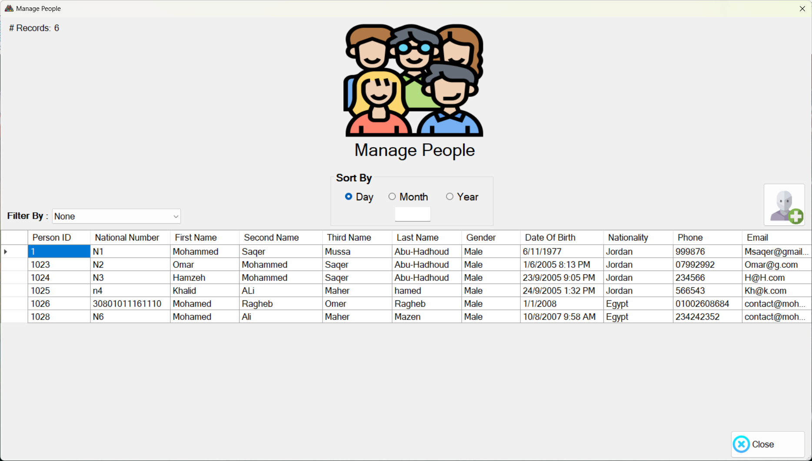
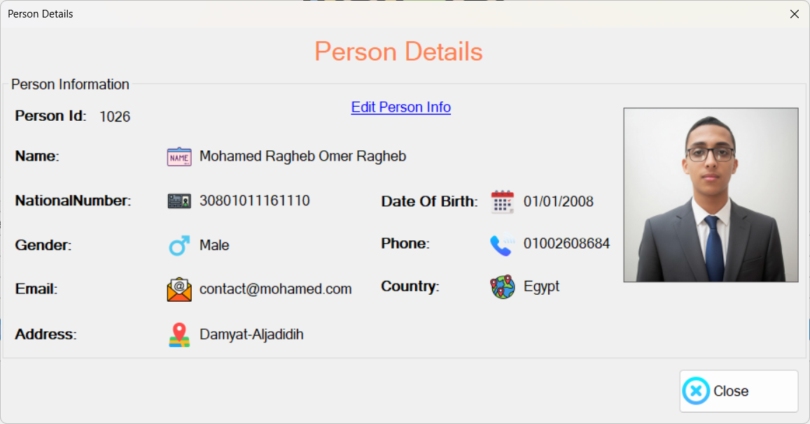
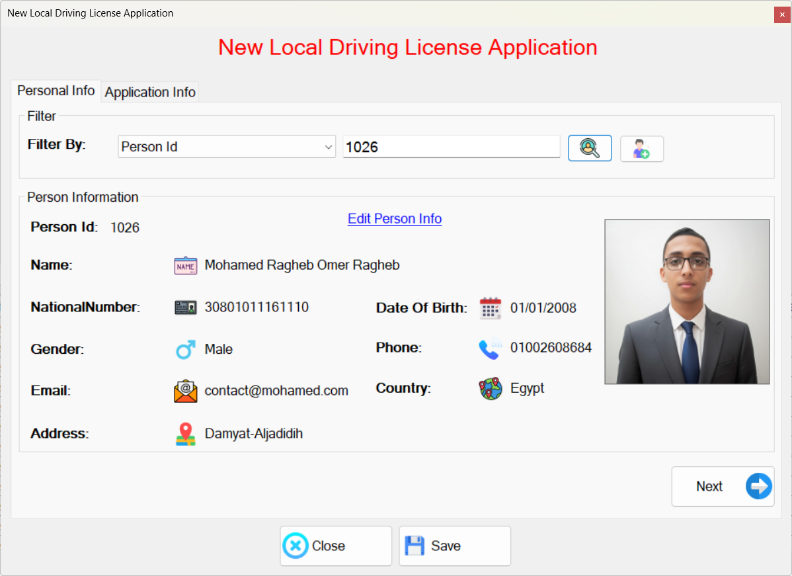
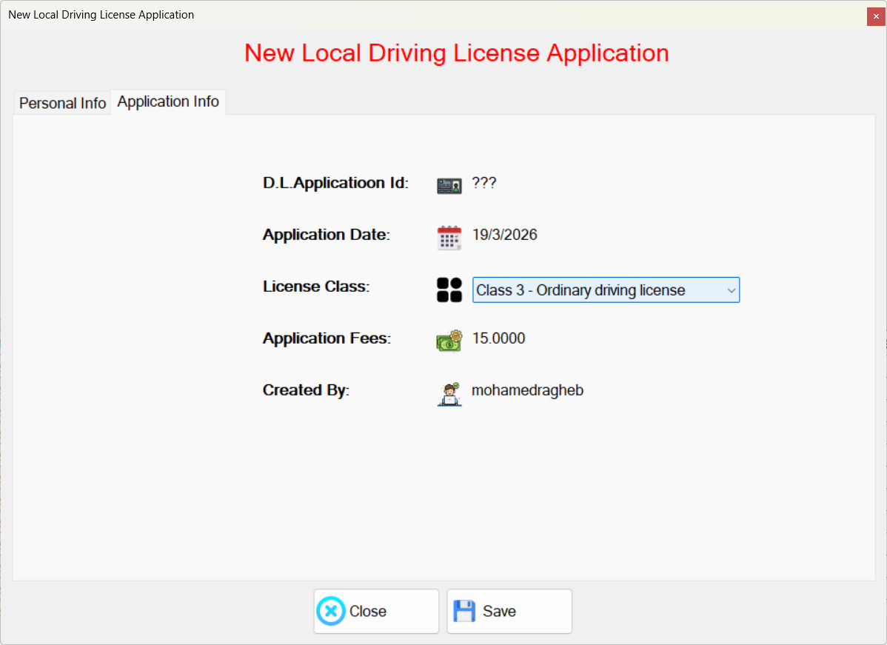
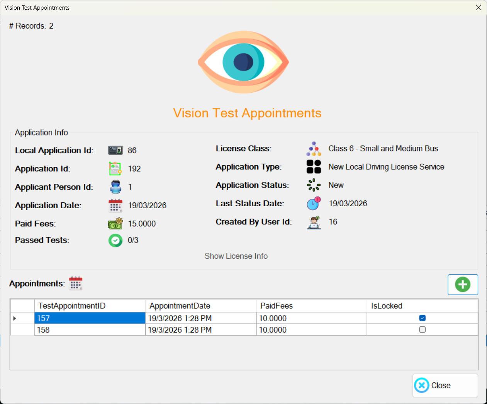
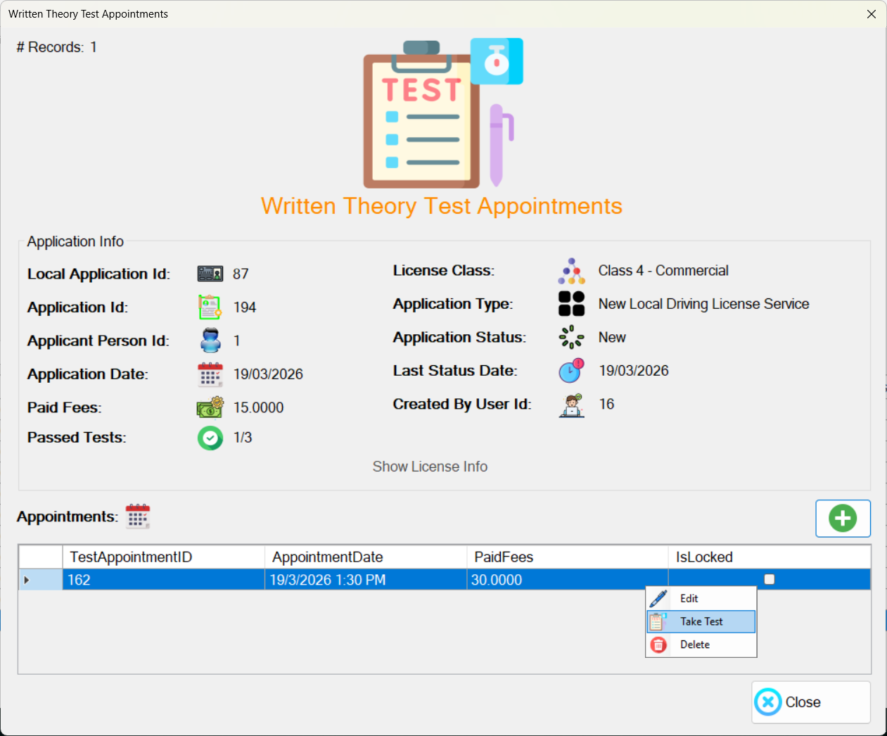
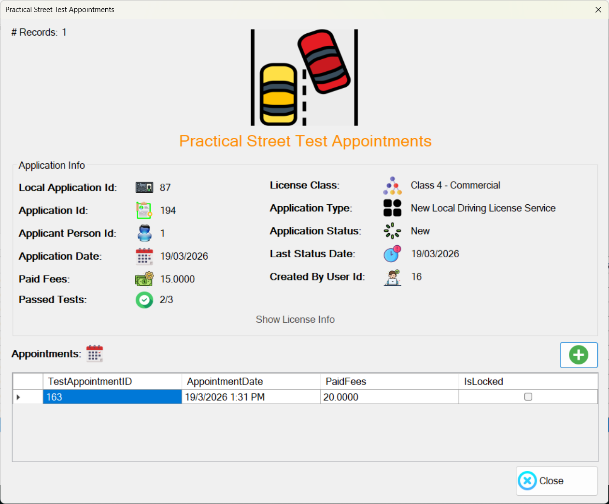

<div align="center">

# 🚗 DVLD - Driving License Management System

### A comprehensive desktop application for managing the complete lifecycle of driving licenses

[](LICENSE)
[](https://www.microsoft.com/windows)
[](https://dotnet.microsoft.com/)
[](https://www.microsoft.com/sql-server)
[](https://visualstudio.microsoft.com/)

<br/>

[Features](#-features) • [Architecture](#-architecture) • [Installation](#-installation) • [Screenshots](#-screenshots) • [Demo](#-demo-video) • [Contact](#-contact)

<br/>



</div>

---

## 📋 Overview

**DVLD (Driving Vehicle Licensing Department)** is a production-ready desktop application designed for government agencies and driving schools to manage the complete driving license lifecycle. The system handles everything from initial applications and testing to license issuance, renewals, replacements, and enforcement actions.

### ✨ Highlights

- 🏗️ **Clean 3-Tier Architecture** — Fully decoupled layers for maintainability and scalability
- 🔒 **Secure User Management** — Role-based access control with password encryption
- 📊 **Comprehensive Logging** — Track all system activities and user actions
- ⚡ **High Performance** — Optimized ADO.NET data access with stored procedures
- 🎯 **Business Rule Enforcement** — Automatic validation of complex licensing rules

---

## 🎬 Demo Video

<div align="center">

**Watch the complete system walkthrough demonstrating all core features**

<a href="https://youtu.be/9oLnLDZ63cs?si=E5AmxEMNU_48F4s1">
  
</a>

*Click the thumbnail above to watch on YouTube*

</div>

---

## 🚀 Features

### 📝 Application Management
| Feature | Description |
|---------|-------------|
| **New License Applications** | Process first-time driving license requests with complete documentation |
| **License Renewals** | Handle expired license renewals with fee calculation |
| **Lost License Replacement** | Issue replacement licenses for lost documents |
| **Damaged License Replacement** | Replace physically damaged licenses |
| **International Licenses** | Issue international driving permits based on valid local licenses |

### 🧪 Test Management
| Feature | Description |
|---------|-------------|
| **Vision Test** | Schedule and record vision/eye examination results |
| **Written Theory Test** | Manage theoretical knowledge assessments |
| **Practical Street Test** | Handle behind-the-wheel driving examinations |
| **Test Retakes** | Process retake applications with dynamic fee calculation |
| **Sequential Enforcement** | Ensure tests are passed in the correct order |

### 🪪 License Classes
The system supports **7 distinct license classes**:

| Class | Type | Description |
|:-----:|------|-------------|
| 1 | Small Motorcycle | Motorcycles up to 125cc |
| 2 | Heavy Motorcycle | Motorcycles over 125cc |
| 3 | Ordinary License | Standard passenger vehicles |
| 4 | Commercial | Taxis and commercial transport |
| 5 | Agricultural | Tractors and farm equipment |
| 6 | Bus (Small/Medium) | Passenger buses up to 26 seats |
| 7 | Truck & Heavy Vehicle | Large trucks and heavy machinery |

### 👥 People & Driver Management
- **Centralized Person Registry** — Single source of truth for all individuals
- **National ID Validation** — Prevent duplicate entries
- **Driver Profiles** — Automatic driver creation upon first license issuance
- **Complete History** — Track all licenses, tests, and applications per person

### ⚖️ Enforcement & Detention
- **License Detention** — Detain licenses for traffic violations
- **Fine Processing** — Record and track violation fines
- **Release Management** — Process detained license releases with fee collection

### ⚙️ Administration
- **User Management** — Create, edit, and deactivate system users
- **Application Types** — Configure available services and their fees
- **License Classes** — Manage validity periods and fee structures
- **Audit Logging** — Track all system changes and user activities

---

## 🏛️ Architecture

The system implements a **clean 3-Tier Architecture** ensuring separation of concerns, maintainability, and testability.

```
┌─────────────────────────────────────────────────────────────────┐
│                    PRESENTATION LAYER                           │
│                      (DVLD.WinForms)                            │
│  ┌─────────┐ ┌─────────┐ ┌─────────┐ ┌─────────┐ ┌─────────┐   │
│  │  Forms  │ │  User   │ │Controls │ │Navigation│ │Resources│   │
│  │         │ │Controls │ │         │ │  Forms  │ │         │   │
│  └────┬────┘ └────┬────┘ └────┬────┘ └────┬────┘ └────┬────┘   │
└───────┼──────────┼──────────┼──────────┼──────────┼───────────┘
        │          │          │          │          │
        └──────────┴──────────┴──────────┴──────────┘
                              │
                              ▼
┌─────────────────────────────────────────────────────────────────┐
│                     BUSINESS LAYER                              │
│                      (DVLD.Business)                            │
│  ┌──────────────────┐  ┌──────────────────┐  ┌───────────────┐ │
│  │ Application      │  │ License          │  │ Test          │ │
│  │ Services         │  │ Services         │  │ Services      │ │
│  ├──────────────────┤  ├──────────────────┤  ├───────────────┤ │
│  │ • ApplicationSvc │  │ • LicenseService │  │ • TestService │ │
│  │ • LocalDLAppSvc  │  │ • DetainedLicSvc │  │ • Appointment │ │
│  │ • AppTypeSvc     │  │ • IntlLicenseSvc │  │   Service     │ │
│  └────────┬─────────┘  └────────┬─────────┘  └───────┬───────┘ │
│           │  ┌─────────────────────────────────────┐ │         │
│           │  │       Entity Validators             │ │         │
│           │  │  (Business Rule Enforcement)        │ │         │
│           │  └─────────────────────────────────────┘ │         │
└───────────┼────────────────────┼────────────────────┼──────────┘
            │                    │                    │
            └────────────────────┴────────────────────┘
                                 │
                                 ▼
┌─────────────────────────────────────────────────────────────────┐
│                       DATA LAYER                                │
│                       (DVLD.Data)                               │
│  ┌──────────────────┐  ┌──────────────────┐  ┌───────────────┐ │
│  │   Application    │  │    License       │  │     Test      │ │
│  │  Repositories    │  │  Repositories    │  │ Repositories  │ │
│  ├──────────────────┤  ├──────────────────┤  ├───────────────┤ │
│  │ • ApplicationRepo│  │ • LicenseRepo    │  │ • TestRepo    │ │
│  │ • LocalDLAppRepo │  │ • DetainedLicRepo│  │ • Appointment │ │
│  │ • AppTypeRepo    │  │ • IntlLicenseRepo│  │   Repo        │ │
│  └────────┬─────────┘  └────────┬─────────┘  └───────┬───────┘ │
│           │  ┌─────────────────────────────────────┐ │         │
│           │  │          Core Repositories          │ │         │
│           │  │  Person │ Driver │ Country │ User   │ │         │
│           │  └─────────────────────────────────────┘ │         │
└───────────┼────────────────────┼────────────────────┼──────────┘
            │                    │                    │
            └────────────────────┴────────────────────┘
                                 │
                                 ▼
┌─────────────────────────────────────────────────────────────────┐
│                        CORE LAYER                               │
│                        (DVLD.Core)                              │
│  ┌──────────────┐ ┌──────────────┐ ┌──────────────────────────┐│
│  │    DTOs      │ │   Enums      │ │       Utilities          ││
│  │  (Entities)  │ │              │ │                          ││
│  ├──────────────┤ ├──────────────┤ ├──────────────────────────┤│
│  │ • Person     │ │ • Gender     │ │ • Validators             ││
│  │ • Driver     │ │ • LicenseClass│ │ • Exceptions            ││
│  │ • License    │ │ • IssueReason│ │ • Logging (AppLogger)    ││
│  │ • Application│ │ • AppStatus  │ │ • Helpers (PathHelper)   ││
│  │ • Test       │ │ • TestType   │ │                          ││
│  │ • User       │ │ • AppType    │ │                          ││
│  └──────────────┘ └──────────────┘ └──────────────────────────┘│
└─────────────────────────────────────────────────────────────────┘
                                 │
                                 ▼
┌─────────────────────────────────────────────────────────────────┐
│                        DATABASE                                 │
│                   Microsoft SQL Server                          │
│  ┌─────────────────────────────────────────────────────────┐   │
│  │    Tables │ Views │ Stored Procedures │ Functions       │   │
│  └─────────────────────────────────────────────────────────┘   │
└─────────────────────────────────────────────────────────────────┘
```

### 📁 Project Structure

```
DVLD-Driving-License-Management-System/
│
├── 📂 DVLD.Core/                    # Core layer - shared across all layers
│   ├── DTOs/
│   │   ├── Entities/                # Data Transfer Objects
│   │   │   ├── Application.cs
│   │   │   ├── Person.cs
│   │   │   ├── Driver.cs
│   │   │   ├── License.cs
│   │   │   ├── Test.cs
│   │   │   └── ...
│   │   └── Enums/
│   │       └── Enums.cs             # System enumerations
│   ├── Validators/                  # Input validation
│   ├── Exceptions/                  # Custom exceptions
│   ├── Logging/                     # Application logging
│   └── Helpers/                     # Utility classes
│
├── 📂 DVLD.Data/                    # Data access layer
│   ├── Application/                 # Application repositories
│   ├── License/                     # License repositories
│   ├── Test/                        # Test repositories
│   ├── CoreRepositories/            # Person, Driver, User, Country
│   └── DataSettings.cs              # Connection string configuration
│
├── 📂 DVLD.Business/                # Business logic layer
│   ├── Application/                 # Application services
│   ├── License/                     # License services
│   ├── Test/                        # Test services
│   ├── CoreServices/                # Person, Driver, User services
│   └── EntityValidators/            # Business rule validators
│
├── 📂 DVLD.WinForms/                # Presentation layer
│   ├── Applications/                # Application management forms
│   ├── Licenses/                    # License management forms
│   ├── Tests/                       # Test management forms
│   ├── People/                      # Person management forms
│   ├── Drivers/                     # Driver management forms
│   ├── Users/                       # User management forms
│   └── NavigateForms/               # Navigation and main forms
│
├── 📂 Database/
│   ├── DVLD_Full_Script.sql         # Complete database script
│   ├── Backups/                     # Database backups
│   └── Diagrams/
│       ├── ERD/                     # Entity Relationship Diagrams
│       └── Relational Schema/       # Database schema diagrams
│
├── 📂 Assets/                       # Screenshots and images
├── 📄 DVLD.slnx                     # Visual Studio solution file
├── 📄 LICENSE                       # MIT License
└── 📄 README.md                     # This file
```

---

## 💻 Technologies Used

<table>
<tr>
<td>

### Backend & Framework
| Technology | Version | Purpose |
|------------|---------|---------|
| C# | 7.3 | Primary language |
| .NET Framework | 4.8 | Runtime framework |
| ADO.NET | - | Data access |
| Windows Forms | - | UI framework |

</td>
<td>

### Database & Tools
| Technology | Version | Purpose |
|------------|---------|---------|
| SQL Server | 2019+ | Database engine |
| T-SQL | - | Stored procedures |
| Visual Studio | 2022 | IDE |
| Git | - | Version control |

</td>
</tr>
</table>

---

## 📦 Installation

### Prerequisites

Before you begin, ensure you have the following installed:

- ✅ **Visual Studio 2022** (or later) with .NET desktop development workload
- ✅ **Microsoft SQL Server 2019** (or later) - Express edition works fine
- ✅ **SQL Server Management Studio (SSMS)** - for database setup
- ✅ **Git** - for cloning the repository

### Step-by-Step Setup

#### 1️⃣ Clone the Repository

```bash
git clone https://github.com/MohamedRaghebOmer/DVLD-Driving-License-Management-System.git
cd DVLD-Driving-License-Management-System
```

#### 2️⃣ Set Up the Database

1. Open **SQL Server Management Studio (SSMS)**
2. Connect to your SQL Server instance
3. Open the file `Database/DVLD_Full_Script.sql`
4. Execute the script to create the database and all objects

```sql
-- The script will create:
-- • DVLD database
-- • All required tables
-- • Stored procedures
-- • Initial lookup data (countries, license classes, etc.)
-- • Sample test data (optional)
```

#### 3️⃣ Configure Connection String

Open `DVLD.Data/DataSettings.cs` and update the connection string:

```csharp
public static readonly string connectionString = 
    "server=YOUR_SERVER_NAME;database=DVLD;user id=YOUR_USER;password=YOUR_PASSWORD;TrustServerCertificate=True";
```

**Examples:**
```csharp
// Windows Authentication (recommended for development)
"server=.;database=DVLD;Integrated Security=True;TrustServerCertificate=True"

// SQL Server Authentication
"server=localhost;database=DVLD;user id=sa;password=YourPassword;TrustServerCertificate=True"

// Named Instance
"server=.\\SQLEXPRESS;database=DVLD;Integrated Security=True;TrustServerCertificate=True"
```

#### 4️⃣ Build and Run

1. Open `DVLD.slnx` in Visual Studio 2022
2. Right-click on `DVLD.WinForms` → **Set as Startup Project**
3. Press `F5` or click **Start** to build and run

#### 5️⃣ Default Login Credentials

| Username | Password | Role |
|----------|----------|------|
| `admin` | `admin` | Administrator |

> ⚠️ **Security Note:** Change the default credentials immediately after first login in a production environment.

---

## 📸 Screenshots

<details>
<summary><b>🔐 Authentication</b></summary>
<br/>
<p align="center">
  
</p>
<p align="center"><i>Secure login with username and password authentication</i></p>
</details>

<details>
<summary><b>🏠 Main Dashboard</b></summary>
<br/>
<p align="center">
  
</p>
<p align="center"><i>Central hub for accessing all system modules</i></p>
</details>

<details>
<summary><b>👥 People Management</b></summary>
<br/>
<p align="center">
  
</p>
<p align="center"><i>Searchable list of all registered persons</i></p>
<br/>
<p align="center">
  
</p>
<p align="center"><i>Detailed person information with photo</i></p>
</details>

<details>
<summary><b>📝 License Applications</b></summary>
<br/>
<p align="center">
  
</p>
<p align="center"><i>Create new driving license application</i></p>
<br/>
<p align="center">
  
</p>
<p align="center"><i>Application processing and status tracking</i></p>
</details>

<details open>
<summary><b>🧪 Test Scheduling</b></summary>
<br/>
<p align="center">
  
</p>
<p align="center"><i>Schedule vision examination</i></p>
<br/>
<p align="center">
  
</p>
<p align="center"><i>Schedule written theory test</i></p>
<br/>
<p align="center">
  
</p>
<p align="center"><i>Schedule practical street driving test</i></p>
</details>

---

## 🗄️ Database Design

<details>
<summary><b>📊 Entity Relationship Diagram (ERD)</b></summary>
<br/>
<p align="center">
  
</p>
</details>

<details>
<summary><b>📐 Relational Schema</b></summary>
<br/>
<p align="center">
  
</p>
</details>

---

## 🎓 What I Learned

Building this system provided hands-on experience with:

| Area | Skills Developed |
|------|------------------|
| **Architecture** | Designing and implementing clean 3-tier architecture from scratch |
| **Business Logic** | Modeling complex real-world business rules and workflows |
| **Data Access** | Working with ADO.NET, stored procedures, and SQL Server |
| **UI Development** | Building reusable WinForms UserControls and forms |
| **Error Handling** | Implementing structured exception handling and logging |
| **Validation** | Creating comprehensive input validation at multiple layers |
| **Security** | Implementing user authentication and role-based access |

---

## 🗺️ Roadmap

Future enhancements planned for this project:

- [ ] 🔄 Migrate from ADO.NET to **Entity Framework Core**
- [ ] 🧪 Add comprehensive **unit testing** with xUnit
- [ ] 🎨 Upgrade UI to **WPF** with modern MVVM pattern
- [ ] 📄 Implement **PDF report generation** for licenses and statistics
- [ ] 🌐 Create a **Web API** version for mobile/web access
- [ ] 📊 Add **dashboard analytics** and reporting
- [ ] 🔔 Implement **email notifications** for expiring licenses
- [ ] 🌍 Add **multi-language support** (localization)

---

## 📄 License

This project is licensed under the **MIT License** - see the [LICENSE](LICENSE) file for details.

```
MIT License

Copyright (c) 2026 Mohamed Ragheb

Permission is hereby granted, free of charge, to any person obtaining a copy
of this software and associated documentation files (the "Software"), to deal
in the Software without restriction...
```

---

## 🤝 Contributing

Contributions are welcome! If you'd like to contribute:

1. Fork the repository
2. Create a feature branch (`git checkout -b feature/AmazingFeature`)
3. Commit your changes (`git commit -m 'Add some AmazingFeature'`)
4. Push to the branch (`git push origin feature/AmazingFeature`)
5. Open a Pull Request

---

## 📬 Contact

<div align="center">

**Mohamed Ragheb Omer**

[](https://www.linkedin.com/in/mohamedraghebomer)
[](mailto:mohamedraghebomer@gmail.com)
[](https://github.com/MohamedRaghebOmer)

</div>

---

<div align="center">

### ⭐ Star this repository if you find it helpful!

Made with ❤️ by [Mohamed Ragheb Omer](https://github.com/MohamedRaghebOmer)

</div>
